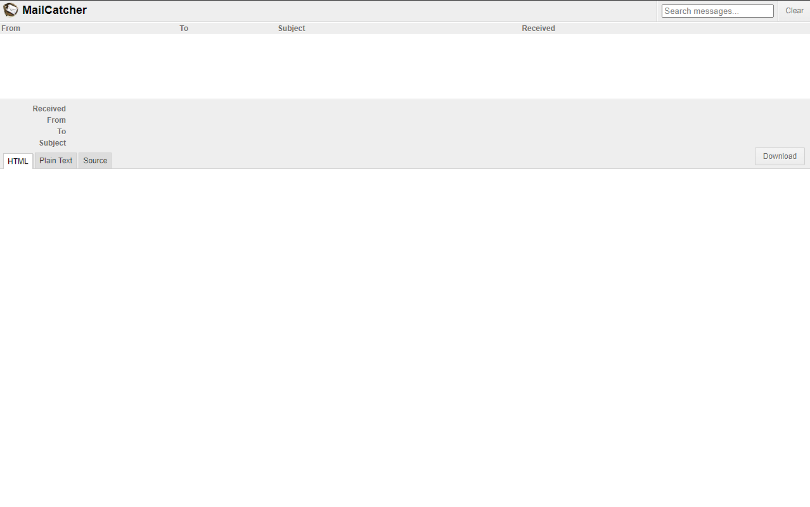
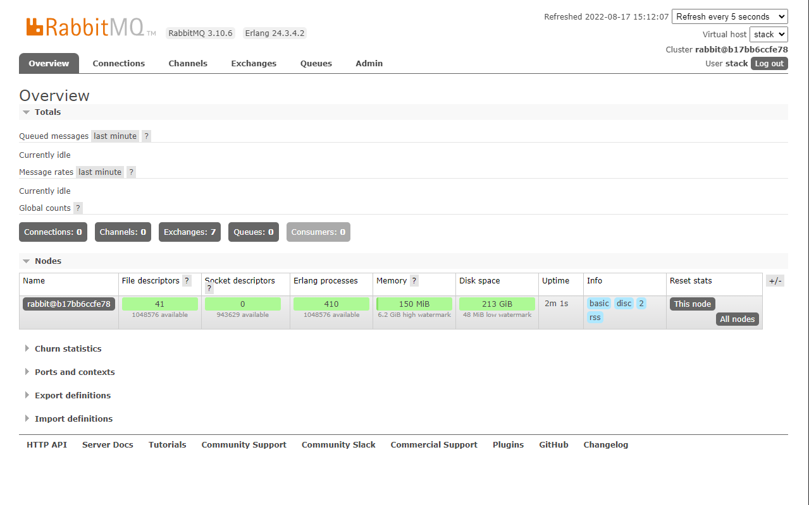
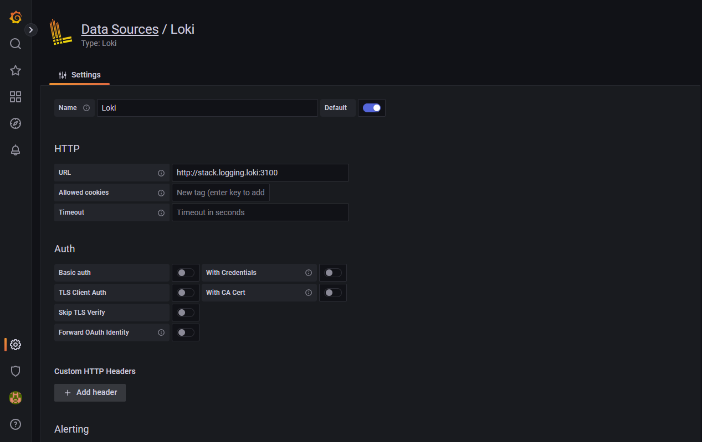
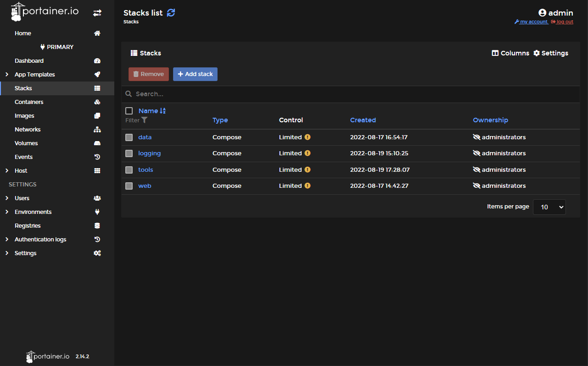

[](https://dl.circleci.com/status-badge/redirect/gh/FabienD/docker-stack/tree/main)
[](https://codecov.io/github/FabienD/docker-stack)
[](https://github.com/FabienD/docker-stack/releases)
[](https://github.com/FabienD/docker-stack/blob/main/LICENSE)

- [The docker Stack](#the-docker-stack)
  - [The "dctl" cli vs docker compose command ?](#the-dctl-cli-vs-docker-compose-command-)
  - [A collection of docker-compose files](#a-collection-of-docker-compose-files)
    - [Requirements](#requirements)
    - [1. Web](#1-web)
      - [1.1. Reverse proxy](#11-reverse-proxy)
      - [1.2. MailCatcher](#12-mailcatcher)
    - [2. Data](#2-data)
      - [2.1. Redis](#21-redis)
      - [2.2. RabbitMQ](#22-rabbitmq)
      - [2.3. PostgreSQL](#23-postgresql)
      - [2.4. MySQL](#24-mysql)
    - [3. Logging](#3-logging)
      - [3.1. Loki](#31-loki)
      - [3.2. Rsyslog](#32-rsyslog)
    - [4. Monitoring](#4-monitoring)
    - [5. Tools](#5-tools)
      - [5.1. Portainer](#51-portainer)
      - [5.2. Grafana](#52-grafana)
  - [A cli tools, a docker compose missing feature](#a-cli-tools-a-docker-compose-missing-feature)
    - [The cli goals](#the-cli-goals)
    - [Installation](#installation)
    - [The config file](#the-config-file)
    - [dctl cli usage](#dctl-cli-usage)
      - [List registered docker-compose files](#list-registered-docker-compose-files)
      - [Start a docker-compose by it alias name](#start-a-docker-compose-by-it-alias-name)
      - [Stop a docker-compose by it alias name](#stop-a-docker-compose-by-it-alias-name)
      - [Stop and remove all containers of a docker-compose by it alias name](#stop-and-remove-all-containers-of-a-docker-compose-by-it-alias-name)
      - [Restart a docker-compose by it alias name](#restart-a-docker-compose-by-it-alias-name)
      - [Show processus list of a docker-compose by it alias name](#show-processus-list-of-a-docker-compose-by-it-alias-name)
      - [Show logs of a docker-compose by it alias name](#show-logs-of-a-docker-compose-by-it-alias-name)
      - [Build a docker-compose by it alias name](#build-a-docker-compose-by-it-alias-name)
      - [Show the path of a docker-compose by it alias name](#show-the-path-of-a-docker-compose-by-it-alias-name)
  - [Use the collection without the cli tool](#use-the-collection-without-the-cli-tool)


# The docker Stack

This project is composed of a collection of usefull docker-compose files for web developpers. We also provide a standalone Cli tool to manage a list of docker compose files registered in a config.

**Cli tool** and **compose files collection** are independants, you can use cli without the compose files and vice versa.

## The "dctl" cli vs docker compose command ?

The command "docker compose" relies on containers launched by docker-compose, you only see docker-compose projects having started or stopped containers.
With the "dctl" cli, we relies on a config file, no need to have started or stopped containers of a docker-compose file to see and manage them.

---

## A collection of docker-compose files

A pre-configured docker-compose files [collection](collection) helping web developers.

The collection is composed of five categories (web, data, logging, tools, monitoring). To use a service, each ```.dist``` files need to be copy as as ```.yml``` file.

| Application     | Description             | Category      | container name | Image docker | Documentation |
|-----------------|-------------------------|------------|----------------|--------------|---------------|
| Traefik | expose localy your application through a local domain | web | stack.web.reverse | [⤴](https://hub.docker.com/_/traefik) | [⤴](https://docs.traefik.io/en/latest/) |
| Mail Catcher | catch all emails sent | web | stack.web.mailcatcher | [⤴](https://hub.docker.com/r/schickling/mailcatcher) | [⤴](https://mailcatcher.me/) |
| PostgreSQL | A relational database | data | stack.data.postgres | [⤴](https://hub.docker.com/_/postgres/) | [⤴](https://www.postgresql.org/docs/) |
| MySQL | A relational database | data | stack.data.mysql | [⤴](https://hub.docker.com/_/mysql) | [⤴](https://dev.mysql.com/doc/) |
| Redis | The cache | data | stack.data.redis | [⤴](https://hub.docker.com/_/redis) | [⤴](https://redis.io/docs/) |
| RabbitMQ| The message broker | data | stack.data.rabbitmq | [⤴](https://hub.docker.com/_/rabbitmq) | [⤴](https://www.rabbitmq.com/documentation.html) |
| Rsyslog | A log aggregator | logging | stack.logging.rsyslog | [⤴]() | [⤴]() |
| Loki | A log aggregator | logging | stack.logging.loki | [⤴](https://hub.docker.com/r/grafana/loki) | [⤴](https://grafana.com/docs/loki/latest/?pg=oss-graf&plcmt=quick-links) |
| Grafana | The dashboard | tools | stack.tools.grafana | [⤴](https://hub.docker.com/r/grafana/grafana) | [⤴](https://grafana.com/docs/grafana/latest/?pg=oss-graf&plcmt=quick-links) |
| Portainer CE | The container manager | tools | stack.tools.portainer | [⤴](https://hub.docker.com/r/portainer/portainer.ce) | [⤴](https://docs.portainer.io/) |

You can add our own services to the collection and customize the existing ones.
**Softwares version** and **few properties** are also **configurable**, this is defined in the environment file on the root of the collection.

If you want to contribute and improve this project, fix a typo, make it better (sorry for my english, please correct me), you're welcome, make me a PR.

### Requirements

[Docker](https://docs.docker.com/engine/install/) is required to run the stack. The stack share the same [docker network](https://docs.docker.com/network/) to facilated communication between containers. The network is named "stack_dev" by default.

```bash
docker network create stack_dev
```

Be free to change the name of the network, you can change it by editing the ```.env``` file in the root of the collection.

Copy the ```.env.dist``` file to ```.env```, and change the value of the ```DOCKER_NETWORK``` variable.

### 1. Web

This is the **base** of all web projects, composed of the following services:

- A reversed proxy service (Traefik) that forwards requests to your different applications. You don't have to worry about multiple applications port number, the request can be routed to the right application by following a local domain name rule (a host rule in Traefik). So, each application can have is own local domain. For example, the application "myapp" can be accessible at the address ```myapp.stack.local```.
- A mail catcher service (MailCatcher) that captures all emails sent from your applications. This is avoid to send accidentally emails to real users, you can also check the content of the emails sent by your application whitout beeing connected to Internet.

#### 1.1. Reverse proxy

The reverse proxy web interface is available via a local domain. The domain is defined in the environnement file, ```DOMAIN```.
To work, ```the local domain should target the Docker Host IP```.

https://dashboard.stack.local (default)


If you want to use a local domain with your application, you must explicitly set the use traefik with docker labels:

```yaml
services:
  # Your application web server
  nginx:
    container_name: myapp-nginx
    image: nginx:1.20
    labels:
      - "traefik.enable=true"
      - "traefik.http.routers.myapp.rule=Host(`myapp.stack.local`)"
      - "traefik.http.routers.myapp.entrypoints=web"
      - "traefik.http.routers.myapp.service=myapp"
      - "traefik.http.services.myapp.loadbalancer.server.port=8080"
    ports:
      - "8080"
```

Your application can be accessed at ```http://myapp.stack.local```. The entrypoint is ```web``` (port 80), Traefik forwards requests to the port 8080 of your application. Note that the application port 8080 is not exposed.

#### 1.2. MailCatcher

The mail catcher web interface is available via a local domain.

http://mailcatcher.stack.local (default)



The SMTP server is exposed on the port 1025, no authentication is required.

### 2. Data

- A Redis service that provides a cache.
- A RabbitMQ service that provides a message broker.
- A PostgreSQL service that provides a PostrgreSQL database instance.
- A MySQL service that provides a MySQL database instance.

#### 2.1. Redis

Redis service is exposed on port 6379, no authentication is required.

#### 2.2. RabbitMQ

RabbitMQ service is exposed on port 5672, and the managment interface is available via http://rabbitmq.stack.local
Credentials are defined in the ```.env``` file.



#### 2.3. PostgreSQL

PostgreSQL service is exposed on port 5432, the default port for PostgreSQL.
Credentials are defined in the ```.env``` file.

#### 2.4. MySQL

MySQL service is exposed on port 3306, the default port for MySQL.
Credentials are defined in the ```.env``` file.

### 3. Logging

- A Loki service (Loki) that provides a log aggregator.
- A log service (Rsyslog) that provides a log aggregator.

#### 3.1. Loki

Loki API service is exposed on port 3100, the default port for Loki. Loki is use to collect Docker logs of containers (where you have selected Loki as driver).

To use Loki, you need to [install the docker driver](https://grafana.com/docs/loki/latest/clients/docker-driver/) before, create the loki configuration using the sample file in ```logging/docker/loki/loki-local-config.yaml```. Then, connect loki API to your Grafana

Loki metrics are accessible at http://loki.stack.local/metrics.

We use Grafana (in the tools stack) to explore loki collected logs.

[Signin in Grafana](http://grafana.stack.local) with the default credentials (admin/admin) and add a Loki datasource. 

[Add a new datasource](http://grafana.stack.local/datasources), and select Loki as type.

Use the Loki container name as URL : http://stack.logging.loki:3100



If you want to see the logs of a container, you must explicitly use Loki as the docker driver and send application log to the standart output.

```yaml
services:
  php-fpm:
    container_name: myapp-php-fpm
    image: myprod/php:8.1-fpm
    logging:
      driver: loki
      options:
        loki-url: http://loki.stack.local/loki/api/v1/push
```

#### 3.2. Rsyslog

WIP, not yet provided.

### 4. Monitoring

WIP, not yet provided.

### 5. Tools

- A container manager, which is a tool to manage containers (Portainer).
- A Grafana service (Grafana) that provides a dashboard to visualize data.

#### 5.1. Portainer

Portainer is a service that provides a web interface to manage containers.

http://portainer.stack.local (default)



#### 5.2. Grafana

As you have seen if you use Loki, Grafana is also used to explore data collected by different types of sources.

You can add a new data source, and select the type of data you want to explore. We use Grafana to visualize tracking and logging data.

http://grafana.stack.local (default)

## A cli tools, a docker compose missing feature

The dctl sources can be found in the [cli](./cli/) path, it's write in Rust.

### The cli goals

The cli tool can "manage" multiple docker-compose files (start, stop, down, restart and build) from everywhere in your terminal.
All registered docker-compose files are stored in a configuration file (config.toml), by default in your home directory (~/.config/dctl/config.toml).

### Installation

You can download the binary from the [release page](https://github.com/FabienD/docker-stack/releases)

Or you can build it from source. You need to [install Rust and Cargo](https://www.rust-lang.org/tools/install) before.

```bash
cd cli && cargo build --release
```

### The config file

The config file is a [TOML](https://toml.io/en/) file, with the following structure.

Note that the **use_project_name**, **description** and the **environment file** are not mandatory.

**use_project_name** is true by default, docker compose will use the alias as project name. For a full compatibilty with project running without setting a [project name](https://github.com/compose-spec/compose-spec/blob/master/spec.md#name-top-level-element), set it to false, docker compose will use the directory name as project name.


```toml
[main]
docker_bin = "/usr/bin/docker"

[[collections]]
alias = "stack_web"
use_project_name = true # Default value is true
description = "Docker stack - web components"
enviroment_file = "/home/fabien/workspace/infra/docker-stack/.env"
compose_files = [
    "/home/fabien/workspace/infra/docker-stack/web/docker-compose.yml",
]

[[collections]]
alias = "stack_logging"
description = "Docker stack - logging components"
enviroment_file = "/home/fabien/workspace/infra/docker-stack/.env"
compose_files = [
    "/home/fabien/workspace/infra/docker-stack/logging/docker-compose.yml",
]

[[collections]]
alias = "stack_tools"
description = "Docker stack - tools components"
enviroment_file = "/home/fabien/workspace/infra/docker-stack/.env"
compose_files = [
    "/home/fabien/workspace/infra/docker-stack/tools/docker-compose.yml",
]

[[collections]]
alias = "stack_data"
description = "Docker stack - data components"
enviroment_file = "/home/fabien/workspace/infra/docker-stack/.env"
compose_files = [
    "/home/fabien/workspace/infra/docker-stack/data/docker-compose.yml",
]

[[collections]]
alias = "project_name1"
enviroment_file = "/home/fabien/workspace/apps/project1/.env"
compose_files = [
    "/home/fabien/workspace/apps/project1/docker-compose.yml",
]

[[collections]]
alias = "project_name2"
use_project_name = false
description = "The project 2"
compose_files = [
    "/home/fabien/workspace/apps/project2/worker/docker-compose.yml",
    "/home/fabien/workspace/apps/project2/api/docker-compose.yml",
]
```

### dctl cli usage

```bash
dctl --help
```

#### List registered docker-compose files

```bash
dctl list
```

#### Start a docker-compose by it alias name

```bash
dctl start <name>
```

#### Stop a docker-compose by it alias name

```bash
dctl stop <name>
```

#### Stop and remove all containers of a docker-compose by it alias name

```bash
dctl down <name>
```

#### Restart a docker-compose by it alias name

```bash
dctl restart <name>
```

#### Show processus list of a docker-compose by it alias name

```bash
dctl ps <name>
```

#### Show logs of a docker-compose by it alias name

```bash
dctl logs <name> [service]
```

#### Build a docker-compose by it alias name

```bash
dctl build <name> [service]
```

#### Show the path of a docker-compose by it alias name

```bash
dctl cd <name>
```

This return the path name of the first docker-compose file of the collection.
We can't directly interact with the shell, you can use the command with the `cd` command.

```bash
cd "$(dctl cd <name>)"
```

Use a shell function to make it easier, for example in your .bashrc or .zshrc

```bash
function gocd() {
    cd "$(dctl cd $1)"
}
```

## Use the collection without the cli tool

You can use all of the docker-compose files without the cli, use docker command like this :

```bash
docker compose -f /docker-stack/web/docker-compose.yml --env-file /docker-stack/collection/.env up -d
```

Notice that tou use the docker compose V2 syntax.
