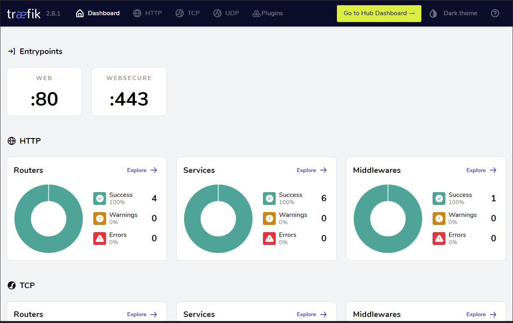
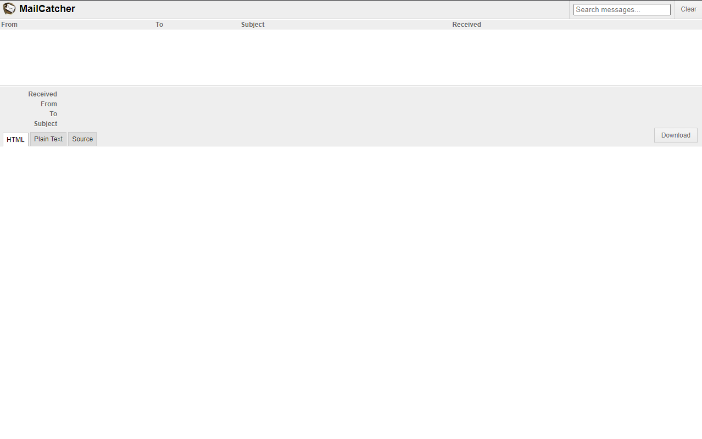
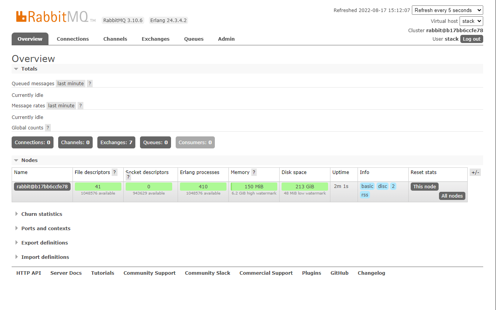

# The docker Stack

This project is composed of a collection of usefull docker-compose files and a cli tool to manage them.

---

## A collection of docker-compose files

A pre-configured docker-compose files [collection](collection) helping web developers.

The collection is composed of five parts. Each ".dist" files need to be copy as as ".yml" file and customized.

| Application     | Description             | Stack      | container name | Image docker | Documentation |
|-----------------|-------------------------|------------|----------------|--------------|---------------|
| Traefik | expose localy your application through a local domain | web | stack.web.reverse | [⤴](https://hub.docker.com/_/traefik) | [⤴](https://docs.traefik.io/en/latest/) |
| Mail Catcher | catch all emails sent | web | stack.web.mailcatcher | [⤴](https://hub.docker.com/r/schickling/mailcatcher) | [⤴](https://mailcatcher.me/) |
| PostgreSQL | A relational database | data | stack.data.postgres | [⤴](https://hub.docker.com/_/postgres/) | [⤴](https://www.postgresql.org/docs/) |
| MySQL | A relational database | data | stack.data.mysql | [⤴](https://hub.docker.com/_/mysql) | [⤴](https://dev.mysql.com/doc/) |
| Redis | The cache | data | stack.data.redis | [⤴](https://hub.docker.com/_/redis) | [⤴](https://redis.io/docs/) |
| RabbitMQ| The message broker | data | stack.data.rabbitmq | [⤴](https://hub.docker.com/_/rabbitmq) | [⤴](https://www.rabbitmq.com/documentation.html) |
| Rsyslog | A log aggregator | logging | stack.logging.rsyslog | [⤴]() | [⤴]() |
| Loki | A log aggregator | logging | stack.logging.loki | [⤴](https://hub.docker.com/r/grafana/loki) | [⤴](https://grafana.com/docs/loki/latest/?pg=oss-graf&plcmt=quick-links) |
| Grafana | The dashboard | tools | stack.tools.grafana | [⤴](https://hub.docker.com/r/grafana/grafana) | [⤴](https://grafana.com/docs/grafana/latest/?pg=oss-graf&plcmt=quick-links) |
| Portainer EE | The container manager | tools | stack.tools.portainer | [⤴](https://hub.docker.com/r/portainer/portainer-ee) | [⤴](https://docs.portainer.io/) |

You can add our own services to the collection, decide which services are enabled by default or not.
Softwares version, credentials are also configurable, this is defined in the environment file on the root of the collection.

Don't hesitate to make a PR to improve the collection.

## Requirements

Docker is required to run the stack. The stack share the same [docker network](https://docs.docker.com/network/) to facilated communication between services. The network is named "stack_dev" in all docker-compose.yml file.

```bash
docker network create stack_dev
```

Be free to change the name of the network or use multiple networks.

### 1. Web

This is the base of all web projects, composed of the following services :

- A reversed proxy service (Traefik), which is a reverse proxy service that forwards requests to the web application.
- A mail catcher service (MailCatcher), which is a service that catches all emails sent to the web application.

#### 1.1. Reverse proxy

The reverse proxy web interface is exposed through a local domain. The domain is defined in the environnement file in the root of the docker-compose files collection.
Copy the .env.dist file to .env, and change the domain to your local domain.

https://dashboard.stack.local (default)



#### 1.2. MailCatcher

As the reverse proxy service, the mail catcher service is also exposed through a local domain.

http://mailcatcher.stack.local (default)



### 2. Data

- A Redis service, which is a service that provides a cache.
- A RabbitMQ service, which is a service that provides a message broker.
- A PostgreSQL service, which is a service that provides a database.
- A MySQL service, which is a service that provides a database.

#### 2.1. Redis

Redis service is exposed on port 6379.

#### 2.2. RabbitMQ

RabbitMQ service is exposed on port 5672, and accessible at http://rabbitmq.stack.local for management.



#### 2.3. PostgreSQL

PostgreSQL service is exposed on port 5432, the default port for PostgreSQL.

#### 2.4. MySQL

MySQL service is exposed on port 3306, the default port for MySQL.

### 3. Logging

- A log service (Rsyslog), which is a service that provides a log aggregator.
- A Loki service (Loki), which is a service that provides a log viewer.

### 4. Monitoring

### 5. Tools

- A container manager, which is a tool to manage containers (Portainer).
- A Grafana service (Grafana), which is a service that provides a dashboard.

---

## A cli tools to register and manage docker-compose files

The cli tools source can be found at [cli](./cli/), it is a Rust binary.

### The cli goals

The cli tool can "manage" multiple docker-compose files (start, stop, restart, ...) from everywhere in your terminal.
All registered docker-compose files are stored in a configuration file (config.toml), by default in your home directory (~/.config/dctl/config.toml).

### The config file

The config file is a TOML file, with the following structure :

```toml
[main]
DOCKER_PATH = "/usr/bin/docker"

[collections]

[collections.stack_web]
enviroment_file = "/home/fabien/workspace/infra/docker-stack/.env"
compose_files = [
    "/home/fabien/workspace/infra/docker-stack/web/docker-compose.yml",
]

[collections.stack_logging]
enviroment_file = "/home/fabien/workspace/infra/docker-stack/.env"
compose_files = [
    "/home/fabien/workspace/infra/docker-stack/logging/docker-compose.yml",
]

[collections.stack_tools]
enviroment_file = "/home/fabien/workspace/infra/docker-stack/.env"
compose_files = [
    "/home/fabien/workspace/infra/docker-stack/tools/docker-compose.yml",
]

[collections.stack_data]
enviroment_file = "/home/fabien/workspace/infra/docker-stack/.env"
compose_files = [
    "/home/fabien/workspace/infra/docker-stack/data/docker-compose.yml",
]

[collections.porject_name1]
enviroment_file = "/home/fabien/workspace/apps/project1/.env"
compose_files = [
    "/home/fabien/workspace/apps/project1/docker-compose.yml",
]

[collections.porject_name2]
enviroment_file = "/home/fabien/workspace/apps/project2/.env"
compose_files = [
    "/home/fabien/workspace/apps/project2/worker/docker-compose.yml",
    "/home/fabien/workspace/apps/project2/api/docker-compose.yml",
]
```


### The cli usage

#### List registered docker-compose files

```bash
dctl list
```

#### Start a docker-compose file

```bash
dctl start -n <name>
```

#### Stop a docker-compose file

```bash
dctl stop -n <name>
```

#### Restart a docker-compose file

```bash
dctl restart -n <name>
```


